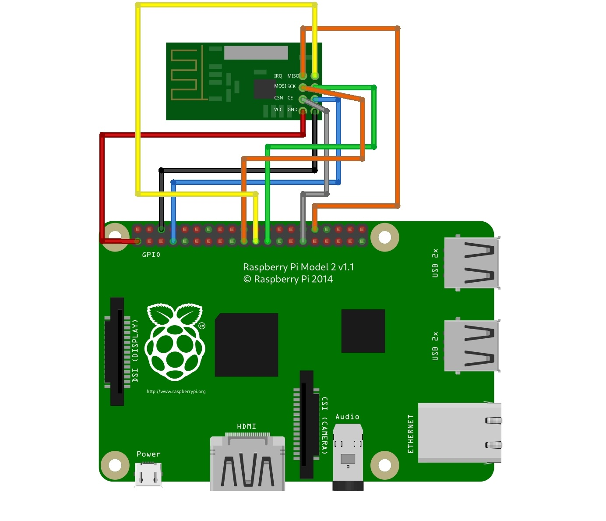

# NRF24L01 Chat Application

**Required Hardware:**

1. Raspberry Pi
2. [NRF24L01 Module](https://lastminuteengineers.com/nrf24l01-arduino-wireless-communication/)

**Required Libaries:**

1. [Circuit Python NRF24L01 Library](https://circuitpython-nrf24l01.readthedocs.io)
2. [GUI Zero](https://lawsie.github.io/guizero/start/)  [optional for GUI]

**Description:**

This is a text-to-text chat, similar to skype, that sends messages across RF using two NRF24 modules to send and recieve messages. Code is written in Python.

Below is a circuit diagram for connecting the module to the Raspberry pi

**(Warning, each module has its own pinout, it is your responsibility to verify the pins)**

